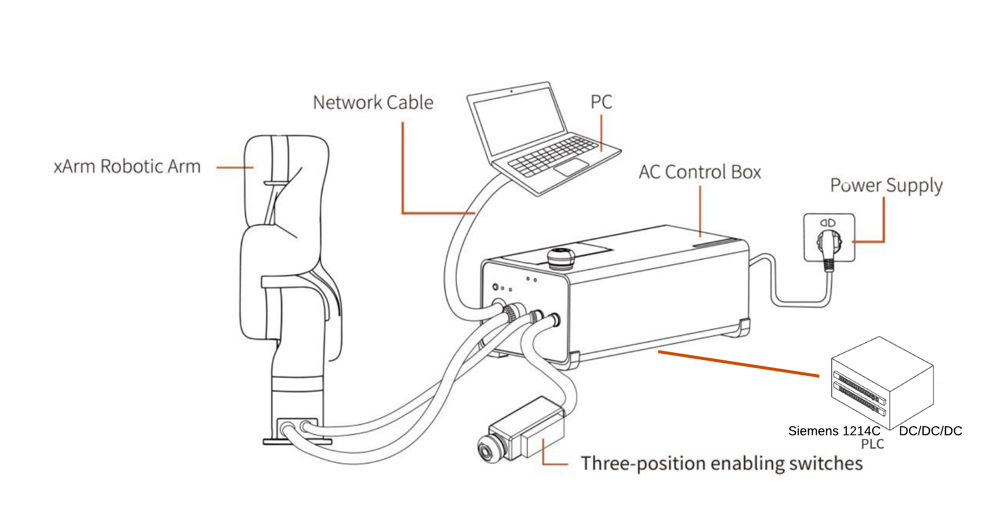

---

# Project Documentation: Interfacing Siemens 1214C DC/DC/DC PLC with uFactory xArm7 Control Box

## Overview

This project demonstrates interfacing a Siemens 1214C DC/DC/DC PLC with a uFactory xArm7 robot equipped with an AC Control Box. The PLC interacts with the configurable I/Os (COs and CIs) of the xArm control box to execute a pick-and-place motion based on inputs received from various components, including a push button and LEDs for feedback.

## Project Components

### PLC Brand Used
- **Model**: Siemens 1214C DC/DC/DC PLC

### Circuit Diagram
The circuit includes the following components:
- **uFactory AC Control Box**
- **Siemens LOGO! Power Supply**
- **5k pull-up resistor**
- **SPST Relay**
- **Push Button (PB)**
- **Green and Red LEDs**
- **PLC**
> _Connection Image:_  
> 

#### Circuit Description

1. **Control Box Outputs**: Since the uFactory AC Control Box configurable outputs (COs) are open collectors, they require a pull-up resistor to interact with the PLC’s digital inputs, which lack built-in pull-up resistors. Each CO from the Control Box connects to a digital input on the PLC, with a 5k pull-up resistor attached to ensure proper input reading.

2. **Control Box Inputs**: The Siemens PLC’s outputs are not relayed, so an SPST relay is used to interface between the PLC outputs and the AC Control Box Configurable Inputs (CIs). This relay allows the PLC output signals to effectively control the Control Box inputs.

> _Detaild Circuit Image:_  
> 

## PLC Ladder Logic Program

The PLC ladder logic program consists of three rungs:

- **Network 1**: Reads the state of the push button (PB). When the push button is pressed, an output connected to the Control Box input is activated to start the robot’s pick-and-place motion.
- **Network 2**: Monitors a digital input connected to the Control Box, which indicates if the robot is moving. When the robot is immobile, a green LED is turned on.
- **Network 3**: Deactivates the red LED when the green LED is on, signaling that the robot is immobile.

> _PLC Ladder Logic Program Image:_  
> 

## Code Explanation

1. **Rung 1**: This rung checks the push button’s status and sends a start signal to the AC Control Box input through the PLC output. This signal initiates the robot’s pick-and-place motion in the Control Box.
2. **Rungs 2 and 3**: These rungs read the status of a PLC input from the Control Box. When the input signal is low (indicating immobility), the green LED lights up, while the red LED turns off.

## Ufactory Studio Blockly Program

The Ufactory Studio Blockly program controls the xArm7 robot to perform a pick-and-place motion. The program logic is as follows:

1. When the signal to initiate motion is received via the CI0 pin from the PLC, the robot begins its pick-and-place operation.
2. While the robot is moving, a signal is sent to the PLC by setting CO0 to HIGH, informing the PLC that the robot is in motion.
3. Once the operation completes, CO0 is reset to LOW, indicating the robot has stopped moving.

> _Ufactory Studio Blockly Program Image:_  
> 

### Code Explanation

- **Start Signal**: The CI0 pin on the Control Box receives a HIGH signal from the PLC to start the pick-and-place routine.
- **Motion Status Signal**: During motion, CO0 is set to HIGH, informing the PLC of the robot’s activity. Upon completion, CO0 is reset, signaling that the robot has stopped moving.

## Contributors

- **Prof. Eng. Jean B. Byiringiro PhD Reg. Emg.** - Project Lead.
- **Newton Kariuki, BSc.** - uFactory xArm7 Blockly Programming, Circuit Design, Documentation, and Testing  
  [newtonkaris45@gmail.com](mailto:newtonkaris45@gmail.com)

- **Jeremiah Kiarie, BSc.** - PLC Ladder Logic Programming, Circuit Design, Documentation, and Testing  
  [jerekiarie01@gmail.com](mailto:jerekiarie01@gmail.com)

> For any questions or further information, feel free to reach out to the contributors via email.

## References

- [Using PLC to Control UFactory xArm](https://help.ufactory.cc/en/articles/4410847-how-to-use-plc-to-control-ufactory-xarm) by Wang Daniel
- _xArm User Manual V2.0.0_

---
